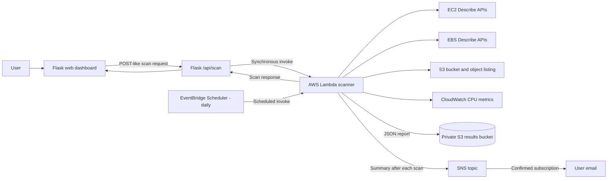

# AWS CostGuard

AWS CostGuard is a single-account AWS resource review dashboard. A Flask web app invokes an AWS Lambda scan, displays the scan results, and the Lambda stores a JSON report in a dedicated S3 bucket. The scanner is read-only for workload resources: it does not stop, resize, move, or delete EC2, EBS, or S3 resources.

> **Project status:** The Flask-to-Lambda scan path, Lambda-to-S3 report write, and Lambda-to-SNS notification are implemented in this repository. Create the SNS topic/subscription and EventBridge schedule in AWS to activate notifications and daily scans. The dashboard displays the response from a fresh scan; it does not yet load the most recent scheduled report from S3 automatically. This is a single-account portfolio project, not a multi-tenant SaaS application.

## What it does

- Lists EC2 instances and checks recent CPU utilization using CloudWatch.
- Lists EBS volumes and flags unattached volumes for review.
- Lists S3 buckets and checks object age, including paginated object listings.
- Returns resource counts, issues, recommendations, scan time, and configured AWS region.
- Writes each Lambda scan report to a dated S3 key under `scans/`.
- Publishes a summary notification to an SNS topic after every successful scan.
- Shows an approximate monthly savings estimate for unattached EBS and older S3 objects.
- Supports a daily EventBridge Scheduler trigger for unattended scans.

## Architecture



## Repository layout

```text
.
├── app.py                   # Flask app and Lambda invoke endpoint
├── lambda_function.py       # EC2/EBS/S3 scanner and report writer
├── lambda_iam_policy.json   # Starting inline policy for the Lambda role
├── requirements.txt         # Local Flask and boto3 dependencies
├── templates/
│   └── index.html           # Dashboard markup and client-side rendering
└── static/
    └── style.css            # Dashboard styling and responsive layout
```

## Requirements

- An AWS account with access to the region you want to scan.
- Python 3.10 or newer for the local Flask app.
- AWS CLI or another supported way to provide local AWS credentials.
- Permissions to create/configure an S3 bucket, Lambda function, IAM roles and policies, and (optionally) an EventBridge schedule.

The Lambda code uses the boto3 SDK included in the AWS-managed Python runtime. AWS periodically updates runtime-included SDK versions; for repeatable production deployments, package and pin dependencies with the function instead. See [AWS Python Lambda packaging](https://docs.aws.amazon.com/lambda/latest/dg/python-package.html) and [supported Lambda Python runtimes](https://docs.aws.amazon.com/lambda/latest/dg/lambda-python.html).

## 1. Configure AWS resources

Choose one AWS region for the Lambda function and EC2/CloudWatch scan. The application defaults to `ap-south-1`; set `AWS_REGION` if you use another region. Create the Lambda function and results bucket in that same region.

### Create the reports bucket

In the S3 console, create a unique bucket for CostGuard scan reports. Keep **Block all public access** enabled. The Lambda writes reports to keys such as:

```text
scans/2026/09/29/123456-<lambda-request-id>.json
```

The scanner excludes the configured results bucket from workload analysis so it does not scan its own reports.

### Create the Lambda execution role

In IAM, create a role for the **Lambda** service. Attach the AWS-managed `AWSLambdaBasicExecutionRole` policy so the function can write its runtime logs to CloudWatch Logs.

Add `lambda_iam_policy.json` as an inline policy. Replace:

```text
REPLACE_WITH_RESULTS_BUCKET
```

with the name of the reports bucket. The policy grants EC2 and CloudWatch read actions, S3 bucket listing, and `s3:PutObject` only for the `scans/` prefix in the reports bucket. `s3:ListBucket` is currently broad because the scanner discovers and lists workload buckets dynamically; narrow it to named bucket ARNs if you want to scan only selected buckets.

Also replace `REPLACE_WITH_SNS_TOPIC_ARN` with the SNS topic ARN you create below. The policy grants `sns:Publish` only to that topic.

The Lambda execution role is different from the credentials used by the local Flask process. AWS explains the purpose of execution roles in [Defining Lambda function permissions](https://docs.aws.amazon.com/lambda/latest/dg/lambda-intro-execution-role.html).

### Create and configure the Lambda function

In the Lambda console, create a function from scratch with a supported Python runtime, for example `python3.14`, and select the execution role created above.

1. Replace the default source in the Lambda code editor with `lambda_function.py`.
2. Set the handler to:

   ```text
   lambda_function.lambda_handler
   ```

3. Choose **Deploy**.
4. Under **Configuration → General configuration**, start with a 512 MB memory size and a 2-minute timeout. A large account or many S3 objects may need a longer timeout; monitor the duration and increase it only as needed.
5. Under **Configuration → Environment variables**, set:

   | Variable | Example | Purpose |
   | --- | --- | --- |
   | `RESULTS_BUCKET` | `my-costguard-scan-results` | Required destination for JSON scan reports |
   | `COSTGUARD_EBS_INR_PER_GB_MONTH` | `7` | Approximate EBS planning rate used by the estimate |
   | `COSTGUARD_S3_INR_SAVING_PER_GB_MONTH` | `1` | Approximate potential S3 tier difference used by the estimate |
   | `SNS_TOPIC_ARN` | `arn:aws:sns:ap-south-1:ACCOUNT_ID:costguard-notifications` | Required SNS topic for scan-complete notifications |

   Lambda provides `AWS_REGION` automatically. The code uses that region for EC2, CloudWatch, and the S3 client unless `AWS_DEFAULT_REGION` is supplied.

6. In the **Test** tab, create a test event with `{}` and run it. Confirm the response contains `success: true`, a JSON file appears in the reports bucket under `scans/`, and the SNS subscriber receives a message.

### Create the SNS topic and subscribe the user

In the SNS console, create a **Standard** topic named `costguard-notifications` in the same region as the Lambda function. Copy its ARN into the Lambda `SNS_TOPIC_ARN` environment variable and into `lambda_iam_policy.json`, then update the Lambda execution role policy.

Create an **Email** subscription for the recipient. The recipient must open the AWS subscription confirmation email and confirm the subscription before notifications arrive. Keep the topic private; the email contains scan counts, an S3 report location, and approximate savings, not AWS credentials.

## 2. Allow the local Flask app to invoke Lambda

The AWS identity used by Flask needs `lambda:InvokeFunction` permission on the CostGuard function ARN. Add a policy like this to the local IAM user/role or profile used by Flask, changing the region, account ID, and function name:

```json
{
  "Version": "2012-10-17",
  "Statement": [
    {
      "Effect": "Allow",
      "Action": "lambda:InvokeFunction",
      "Resource": "arn:aws:lambda:ap-south-1:ACCOUNT_ID:function:costguard-scan"
    }
  ]
}
```

Do not attach this invoke permission to the Lambda execution role unless the function itself needs to invoke another Lambda. Never commit access keys or secret keys to this repository.

## 3. Run the Flask dashboard locally

Open PowerShell in the project directory. Create and activate a virtual environment, then install the local requirements:

```powershell
python -m venv .venv
.\.venv\Scripts\Activate.ps1
python -m pip install -r requirements.txt
```

Copy `.env.example` to `.env`, then set the region and deployed Lambda function name/ARN:

```powershell
Copy-Item .env.example .env
notepad .env
```

Example `.env` values:

```dotenv
AWS_REGION=ap-south-1
COSTGUARD_LAMBDA_FUNCTION=costguard-scan
```

Use your actual Lambda function name or ARN if it differs. `.env` is ignored by Git. Configure AWS credentials separately through the AWS SDK credential chain (for example, a local AWS CLI profile); do not put access keys in `.env`.

Start Flask:

```powershell
python app.py
```

Open [http://127.0.0.1:5000](http://127.0.0.1:5000), then select **Scan AWS**. Flask invokes Lambda synchronously, waits for its response, and returns the scan data to the dashboard. The Lambda also writes that report to S3.

`app.py` is configured for local development and currently starts Flask with debug mode enabled. Do not expose this development server directly to the public internet. A production deployment should use an appropriate WSGI server, authentication, HTTPS, and an AWS IAM role for the Flask host instead of local credentials.

## 4. Optional: schedule daily scans

After the SNS subscription and manual Lambda test succeed, create the daily schedule in **Amazon EventBridge Scheduler**:

1. Create a recurring schedule using `cron(0 9 * * ? *)` for a daily 9:00 AM scan.
2. Set the time zone to `Asia/Kolkata`.
3. Choose the CostGuard Lambda function as the target and set the input to:

   ```json
   {"source":"eventbridge-daily"}
   ```

4. Let the console create an execution role, or create one with `lambda:InvokeFunction` permission for only this function.
5. Enable the schedule and check the Lambda CloudWatch Logs and S3 reports after its next run.

EventBridge Scheduler supports a selected time zone and Lambda as a target. See [Schedule types](https://docs.aws.amazon.com/scheduler/latest/UserGuide/schedule-types.html) and [Scheduler setup](https://docs.aws.amazon.com/scheduler/latest/UserGuide/setting-up.html). Both dashboard-triggered scans and scheduled scans publish to the same SNS topic; the notification labels the trigger as dashboard or scheduled daily.

**Current dashboard limitation:** a scheduled invocation saves its result to S3, but the current dashboard does not fetch the latest saved report. The dashboard's **Scan AWS** button always requests a fresh scan. To show scheduled results in the UI, add a Flask endpoint that reads the latest S3 report and connect the dashboard to that endpoint.

## API

### `GET /api/scan`

Invokes the configured Lambda synchronously. A successful response includes:

```json
{
  "success": true,
  "resources": [],
  "total": 0,
  "waste": 0,
  "suggestions": 0,
  "resource_counts": {"EC2": 0, "EBS": 0, "S3": 0},
  "monthly_savings_estimate_inr": 0,
  "scanned_at": "UTC timestamp",
  "region": "ap-south-1",
  "report_bucket": "my-costguard-scan-results",
  "report_key": "scans/...json"
}
```

If Lambda invocation fails, Flask returns HTTP `502` with an error message.

## How findings and estimates work

- **EC2:** average of the available `CPUUtilization` datapoints over the last six hours. A running instance below 10% average CPU is flagged for review. No CloudWatch datapoints are reported as `Monitoring`. CPU alone is not enough to safely right-size an instance; review memory, application load, and a longer time window before making changes.
- **EBS:** an unattached volume is flagged as `Unused`. Its planning estimate is `volume size in GB × COSTGUARD_EBS_INR_PER_GB_MONTH`.
- **S3:** objects at least 90 days old are counted and their sizes are totaled. The planning estimate is `old object size in GB × COSTGUARD_S3_INR_SAVING_PER_GB_MONTH`.
- The default rates are illustrative placeholders, not live AWS pricing. They do not account for exact region, volume type, S3 storage class, retrieval charges, minimum storage duration, taxes, or negotiated discounts.
- EC2 right-sizing savings are reported as zero because this project does not query instance prices or actual usage costs.
- Recommendations are advisory. CostGuard does not automatically change or delete AWS resources.

## Permissions and security notes

- This version scans resources visible to the Lambda execution role in one configured AWS account.
- The Lambda role should remain read-only for workload resources; it needs write access only to the dedicated report prefix in the results bucket.
- Keep the results bucket private and do not put AWS credentials in source code, screenshots, or GitHub.
- If you host Flask on AWS later, give the host an IAM role limited to invoking this Lambda. For local use, use an AWS CLI profile or another supported credential provider.
- This version is **not multi-user or multi-account**. It has no user login, customer account connection flow, cross-account role assumption, or tenant-level authorization.
- Before making the repository public, review source code and commit history for account-specific ARNs, credentials, bucket names, and other private information.

## Troubleshooting

| Symptom | Check |
| --- | --- |
| `COSTGUARD_LAMBDA_FUNCTION` error | Set the environment variable in the same terminal before starting Flask. |
| Flask returns `502` | Check the Lambda ARN/region, Flask identity's `lambda:InvokeFunction` permission, and Lambda execution logs. |
| Lambda reports `AccessDenied` | Check the Lambda execution role and replace the results bucket placeholder in its inline policy. |
| Lambda reports missing `RESULTS_BUCKET` | Add the environment variable to the Lambda configuration and deploy/save the settings. |
| Lambda reports missing SNS topic configuration | Set `SNS_TOPIC_ARN`, update the Lambda role policy, and deploy the function. |
| Scan succeeds but no email arrives | Confirm the SNS email subscription in the recipient's inbox and verify the topic ARN/region. |
| EventBridge scan does not run | Check the schedule state, time zone, target ARN, and Scheduler role's `lambda:InvokeFunction` permission. |
| Lambda times out | Check invocation duration and S3 object count; increase the timeout only after reviewing logs. |
| EC2 CPU says `Monitoring` | CloudWatch may not have recent datapoints, or the role may lack `cloudwatch:GetMetricStatistics`. |
| S3 bucket says `Unable to analyze` | Check `s3:ListBucket` permission and whether the function can list objects in that bucket/region. |
| Report is not in S3 | Confirm the result bucket name/region, `s3:PutObject` permission, and Lambda logs. |

## Possible next improvements

- Add a Flask endpoint to load the newest report from S3 for scheduled scans.
- Replace estimate constants with region- and storage-class-aware pricing, and show the assumptions in the UI.
- Add tests with mocked boto3 clients for pagination, permission errors, and empty scans.
- Add authentication and cross-account role assumption with a unique external ID before supporting customer AWS accounts.
- Add infrastructure-as-code (AWS SAM, CDK, or Terraform) so the bucket, roles, Lambda, and schedule can be recreated consistently.
